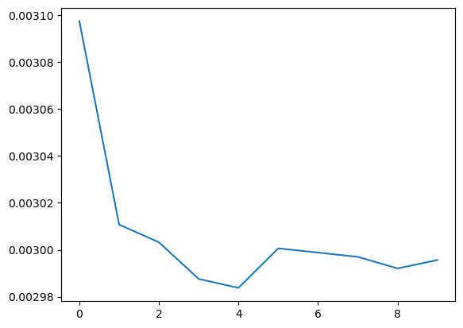

# Training results

## GRUNet Model

The first 3 models have been trained on sequence length lower than 500. Thus not the entire dataset.\
The dataset choosed to train the models is "low_dataset".\
557 data for training and 140 data for testing

### Grunet0.1
Architecture is as following

```python
super(GRUNet, self).__init__()
self.hidden_size = hidden_size
self.dropout = nn.Dropout(dropout_p)
self.gru = nn.GRU(input_size, hidden_size, batch_first=True)
self.linear = nn.Linear(hidden_size, output_size, device=device)
```

Hyper parameters are

```python
optimizer = optim.Adam(seqModel.parameters(), lr=0.001)
criterion = nn.MSELoss()
hidden_size = 128
batch_size = 4
input_size = 17 #number of action units detected with Openface
output_size = 61 #number of blendshape detected with Arkit liveface
n_epochs = 80
```

trained over the low_uterrance_dataset where MAX_LENGTH is 500 frames which gave 697 dataframe


#### Training

```
total loss: 0.002516078353094469
--- 45.91899609565735 seconds ---
```

#### Testing
```
mean  MSE Loss: 0.0016506112230542515
--- 0.25000691413879395 seconds ---
```


### Grunet0.2
This model adds a custom loss function : negRELU, which penalizes negative values over the network. We add the mean of the result to the MSELoss and then backwards to update the weights
trained over the low_uterrance_dataset where MAX_LENGTH is 500 frames

```python
def NegRELU(tensor):
    relu = nn.ReLU()
    relu(torch.neg(tensor))
```

#### Training
```
mean loss: 0.0017921864255497765
--- 54.49406719207764 seconds ---
```


#### Testing
```
mean  MSE Loss: 0.0014992635597341826
--- 0.16599225997924805 seconds ---
```


### Grunet0.3
This model pads the sequences of a batch to match the largest sequence, it is trained batch-wise, so that it can have variable input length data
It required a custom Dataset class and a collate_fn function to correctly batch the data
1. Batched data is sorted by length
2. list of lengths of data, later used to pack and pad sequences
3. List of tensors for both inputs and targets
4. pad the lists of tensors so that it match the largest sequence in the batch
5. return the padded inputs, targets and list of lengths

Batch_size : 4
epochs : 80

#### Training

```
total loss: 0.0010553993512888717
--- 368.37300062179565 seconds ---
```


#### Testing
With 20% test data (188 dataframes from low voice)

```
mean r2 score: 0.7519840509333509
--- 0.8249990940093994 seconds ---
```


```
mean  MSE Loss: 0.0008667057096472684
--- 0.6714887619018555 seconds ---
```


### Grunet0.4
The difference is forward and forward step as a sequence to sequence model
batch_size : 4
epochs : 10


#### Training
```
mean loss: 0.001536625583886486
--- 897.7150955200195 seconds ---
```


#### Testing

```
mean  MSE Loss: 0.0015059322257466772
--- 10.345996141433716 seconds ---
```


Scores are very similar to Grunet0.3 but it is significantly slower, not worth it

### Grunet0.5
Implement Badhanau Attention mechanism that relies on Grunet0.4 architecture, particularly the forward method
hidden_size = 128
batch_size = 4
epochs = 10
#### Training
```
mean loss: 0.002995633195886122
--- 1425.9745845794678 seconds ---
```



#### Testing
```
last computed MSE Loss: 0.002826639763744814
--- 14.053028583526611 seconds ---
```


### Grunet0.6
Improvement over 0.5, less code, and ignore 0 padding

#### Training

```
last computed loss: 0.006979082293608891
--- 1372.0115020275116 seconds ---
```


#### Testing
```
mean  MSE Loss: 0.007445484832195299
--- 17.450531244277954 seconds ---
```
