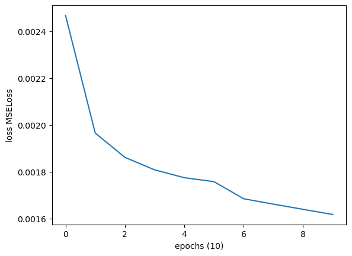
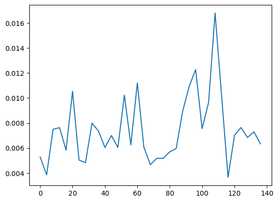

# Training results

## GRUNet Model

The first 2 models have been trained on sequence length lower than 500. Thus not the entire dataset.\
The dataset choosed to train the models is "low_dataset".\
557 data for training and 140 data for testing

### Grunet
Architecture is as following

```python
super(GRUNet, self).__init__()
self.hidden_size = hidden_size
self.dropout = nn.Dropout(dropout_p)
self.gru = nn.GRU(input_size, hidden_size, batch_first=True)
self.linear = nn.Linear(hidden_size, output_size, device=device)
```

Hyper parameters are

```python
optimizer = optim.Adam(seqModel.parameters(), lr=0.001)
criterion = nn.MSELoss()
hidden_size = 128
batch_size = 4
input_size = 17 #number of action units detected with Openface
output_size = 61 #number of blendshape detected with Arkit liveface
n_epochs = 80
```

trained over the low_uterrance_dataset where MAX_LENGTH is 500 frames which gave 697 dataframe


#### Training

```
total loss: 0.002516078353094469
--- 45.91899609565735 seconds ---
```

with 100 epochs
epoch: 100	loss: 0.001016512462693425
--- 444.21149611473083 seconds ---

with 100 epochs and relu
epoch: 100	loss: 0.0010265789887659805
--- 498.93149852752686 seconds ---

l1 loss and relu
epoch: 100	loss: 0.0108264312470094
--- 555.5440020561218 seconds ---

#### Testing
```
mean  MSE Loss: 0.0016506112230542515
--- 0.25000691413879395 seconds ---
```

with 100 epochs trained
mean  MSE Loss: 0.0009830770616238798
mean activation precision: 0.6034927179055024
mean activation recall: 1.0
--- 0.6444973945617676 seconds ---

with 100 epochs trained and relu
mean  MSE Loss: 0.0010162036328147997
mean activation precision: 0.9023062400041343
mean activation recall: 0.7712420368318854
--- 0.8959968090057373 seconds ---

l1 loss and relu
mean  l1 Loss: 0.013275263655157958
mean activation precision: 0.9564411826111147
mean activation recall: 0.7762002613155174
--- 0.9009933471679688 seconds ---


### Grunet0.2
This model adds a custom loss function : negRELU, which penalizes negative values over the network. We add the mean of the result to the MSELoss and then backwards to update the weights
trained over the low_uterrance_dataset where MAX_LENGTH is 500 frames

```python
def NegRELU(tensor):
    relu = nn.ReLU()
    relu(torch.neg(tensor))
```

#### Training
```
mean loss: 0.0017921864255497765
--- 54.49406719207764 seconds ---
```


#### Testing
```
mean  MSE Loss: 0.0014992635597341826
--- 0.16599225997924805 seconds ---
```


### Grunet0.3
This model pads the sequences of a batch to match the largest sequence, it is trained batch-wise, so that it can have variable input length data
It required a custom Dataset class and a collate_fn function to correctly batch the data
1. Batched data is sorted by length
2. list of lengths of data, later used to pack and pad sequences
3. List of tensors for both inputs and targets
4. pad the lists of tensors so that it match the largest sequence in the batch
5. return the padded inputs, targets and list of lengths

Batch_size : 4
epochs : 80

#### Training

```
total loss: 0.0010553993512888717
--- 368.37300062179565 seconds ---
```


#### Testing
With 20% test data (188 dataframes from low voice)

```
mean r2 score: 0.7519840509333509
--- 0.8249990940093994 seconds ---
```


```
mean  MSE Loss: 0.0008667057096472684
--- 0.6714887619018555 seconds ---
```


### GrunetSeq
The difference is forward and forward step as a sequence to sequence model. Trained on scripts with length < 500
```python
batch_size : 4
hidden_size : 128
epochs : 10
```
#### Training
```
epoch: 10	loss: 0.0016177178664033168
--- 6888.725522518158 seconds ---
```



#### Testing

```
mean  MSE Loss: 0.0018346057248501374
mean activation precision: 0.6028487736108044
mean activation recall: 1.0
--- 8.40849757194519 seconds ---
```


Scores are very similar to Grunet0.3 but it is significantly slower, not worth it

### Grunet0
Implement Badhanau Attention mechanism that relies on Grunet0.4 architecture, particularly the forward method. Trained only on subset of the dataset where script lengths < 500
```python
hidden_size = 128
batch_size = 4
epochs = 10
```
#### Training
```
epoch 10 loss: 0.002995633195886122
--- 1425.9745845794678 seconds ---
```


#### Testing
```
mean MSE Loss: 0.002826639763744814
--- 14.053028583526611 seconds ---
```


### Grunet0.6
Improvement over 0.5, less code, and ignore 0 padding when computing loss + for inference too. Trained only on subset of the dataset where script lengths < 500

#### Training

```
last computed loss: 0.006979082293608891
--- 1372.0115020275116 seconds ---
```


#### Testing
```
mean  MSE Loss: 0.007445484832195299
--- 17.450531244277954 seconds ---
```



### Grunet0.7 (Grunet0.35)
The same as Grunet0.3 except that loss do not take 0 padding into account, and there is no dropout, and only infer on the 52 blendshapes
Objective is to compare inference input by input vs inference with the whole sequence as input
Can compare with 0.6 but not Grunet0.5 et 0.4 as they take 0 padding inside loss function, thus reducing the loss
Trained only on subset of the dataset where script lengths < 500.
Results in Unity are quite good in fact.

Hyper parameters:
```python
Epochs : 80
lr : 0.001
batch_size = 4
input_size = 17 #number of action units detected with Openface
output_size = 52 #number of blendshape detected with Arkit liveface
Adam optimizer
MSELoss()
```

#### Training
```
epoch 80 loss: 0.0032797726902312465
--- 184.77103424072266 seconds ---
```
```
epoch: 10	loss: 0.008067962094309164
--- 155.24750065803528 seconds ---
```


#### Testing
```
mean MSE Loss: 0.004446076495306832
--- 0.518500566482544 seconds ---
```

Testing after training for 10 epochs only
```
mean  MSE Loss: 0.0069952825817497484
mean activation precision: 0.6034927179055024
mean activation recall: 1.0
--- 1.0679996013641357 seconds ---
```


With these results, after comparing the seq to seq model with attention, inference time is better, results are better. We can choose to work on these networks GRU based only for the rest of the internship. Even though I would like to try with transformers

### Grunet0.75
Little improvement over 0.7, this time loss is computed for each blendshape columns, loss scale is very different from the above results, but when results are tested in Unity, they look nice; similarly to Grunet0.7. In fact I doubt there is much difference after all, even accounting for the loss scale. Loss is just computed differently this time.
This is the piece of code that changes

```python
def train_epoch(seqModel, dataloader, optimizer, criterion):
    ....
    for p, t in zip(pred, target_tensor): 
        # loss += criterion(
        #     p.view(-1),
        #     t.view(-1)
        # )
        for i, (bs_pred, bs_target) in enumerate(zip(p.permute(1, 0), t.permute(1, 0))): #To iterate over each bs columns, we must permute both dimensions
            loss_arr[i]+= criterion(bs_pred, bs_target)
    loss = torch.sum(loss_arr)
    loss.backward()
```

Same hyper parameters has 0.7, trained on scripts length < 500

#### Training
```
 loss: 0.16581079233437776
--- 870.7465357780457 seconds ---
```

#### Testing
```
mean  MSE Loss: 0.0043448747933975285
--- 0.45096707344055176 seconds ---
```


### GRuNet 0.8
Grunet0.7 but with BCE loss to detect which bs to activate for each frame
epochs = 10
lr=0.001

#### Training
```
with 0.001*bce_loss
 loss: 0.08748945356049437
--- 237.69500088691711 seconds ---
```
```
with 0.01*bce_loss
 loss: 0.6203293733774348
--- 254.06699347496033 seconds ---
```
```
with 0.1*bce_loss
 loss: 7.167337180452144
--- 237.8369972705841 seconds ---
```
```
without bce_loss (still takes as much as time because the second linear layer and sigmoid layer are processed)
epoch: 10	loss: 0.007920979935195336
--- 178.36400032043457 seconds ---
```
```
with bce_loss*1
epoch: 10	loss: 82.89768647133036
--- 231.17297053337097 seconds ---
```

#### Testing
```
with 0.001*bce_loss
mean  MSE Loss: 0.010763753859445136
mean activation precision: 0.7718143686657696
mean activation recall: 0.6845629835587843
--- 1.0594940185546875 seconds ---
```
```
with 0.01*bce_loss
mean  MSE Loss: 0.009364774351582882
mean activation precision: 0.7379631883270096
mean activation recall: 0.7438368051983015
--- 1.0344934463500977 seconds ---
```
```
with 0.1*bce_loss
mean  MSE Loss: 0.010310659036436614
mean activation precision: 0.7394103890009489
mean activation recall: 0.7634905457847214
--- 1.2004938125610352 seconds ---
```
```
without bce_loss
mean  MSE Loss: 0.007446064237267413
mean activation precision: 0.6034927179055024
mean activation recall: 1.0
--- 1.0219981670379639 seconds ---
```
```
with bce_loss*1
mean  MSE Loss: 0.013542516890199894
mean activation precision: 0.7386182350141083
mean activation recall: 0.653014217685672
--- 0.9039952754974365 seconds ---s
```
```
with bce_loss.mean()
mean  MSE Loss: 0.005281518014713323
mean activation precision: 0.7327113728368425
mean activation recall: 0.5058325071173476
```
```
with bce_loss/batch_size
mean  MSE Loss: 0.002542803399098505
mean activation precision: 0.7423874097259686
mean activation recall: 0.791081798052237
--- 0.8029904365539551 seconds ---
```
```
with bce_loss/batch_size*0.1
mean activation precision: 0.7094847695850388
mean activation recall: 0.6839376301636666
--- 0.7114999294281006 seconds ---
```

### FCNet
batch_size = 4
lr=0.001
hidden_size = 256
Just 4 fully connected layer Net

#### Training
```
with one hidden layer
epoch: 10	loss: 0.00961852553573021
--- 96.17597126960754 seconds ---
```
```
with 2 hidden layer
epoch: 10	loss: 0.00976796244132392
--- 115.40349888801575 seconds ---
```
```
with 1 hidden and out relu
epoch: 10	loss: 0.00969386403820418
--- 101.40549850463867 seconds ---
```

#### Testing
```
with one hidden layer
mean  MSE Loss: 0.012156538704925396
mean activation precision: 0.535162643207856
mean activation recall: 1.0
--- 1.048499584197998 seconds ---
```
```
with 2 hidden layer
mean  MSE Loss: 0.011288762994189846
mean activation precision: 0.535162643207856
mean activation recall: 1.0
--- 0.8959977626800537 seconds ---
```
```
with 1 hidden and out relu
mean  MSE Loss: 0.011288762994189846
mean activation precision: 0.535162643207856
mean activation recall: 1.0
--- 0.8959977626800537 seconds ---
```

### Grunet0.65 (with lookback)
Redo the network to make it work by infering 10 words by 10 instead of one by one
batch_size = 8

#### Training

```
epoch: 10	loss: 0.016655810150716988
--- 1510.0239989757538 seconds ---
```


#### Testing
```
mean  MSE Loss: 0.014868973185204797
mean activation precision: 0.6028951724597132
mean activation recall: 0.9996452009775536
--- 1.4015002250671387 seconds ---
```
